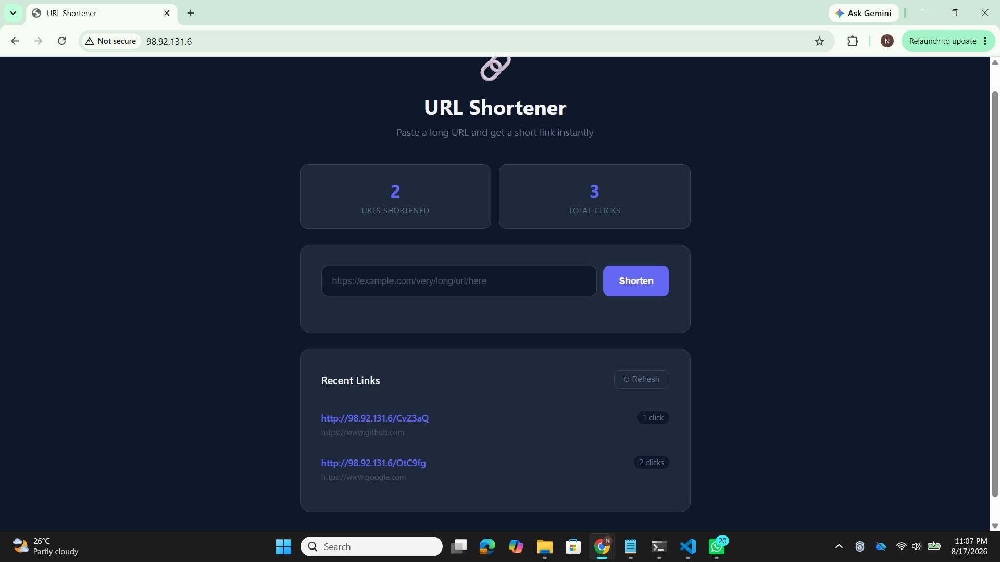
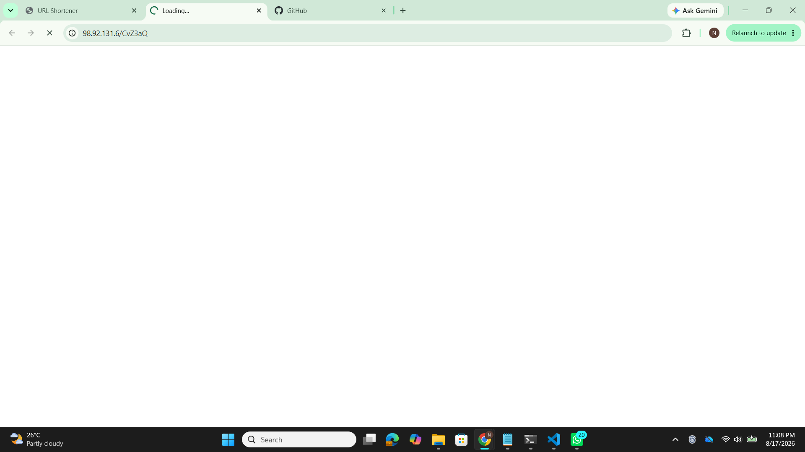
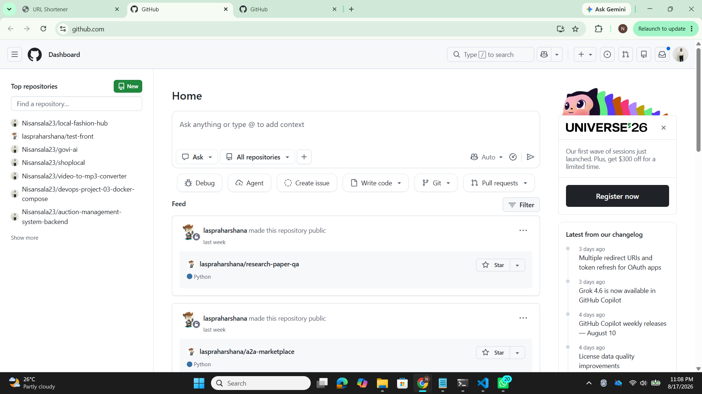
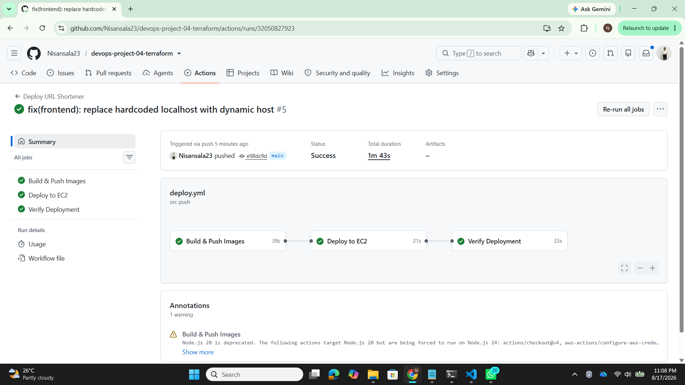
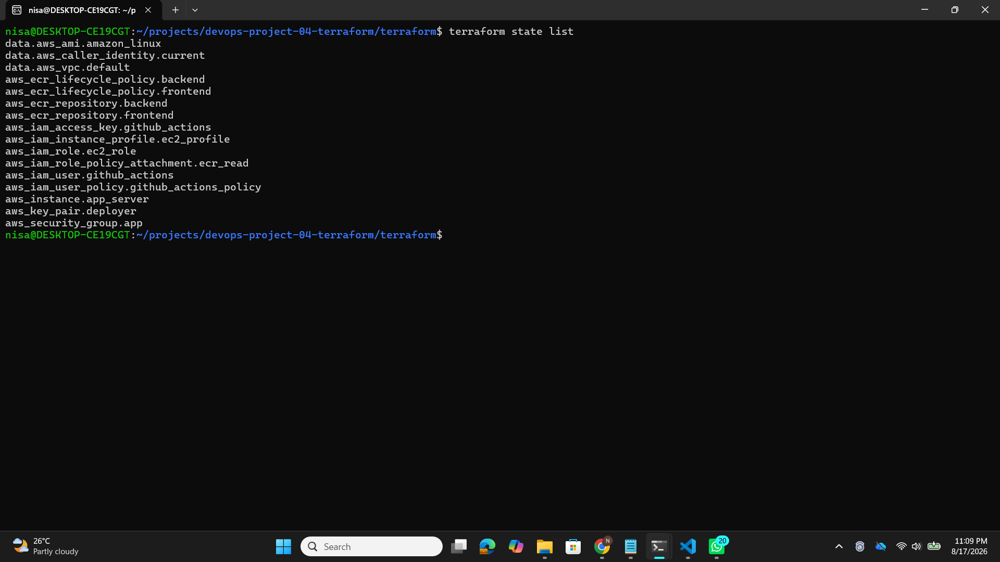
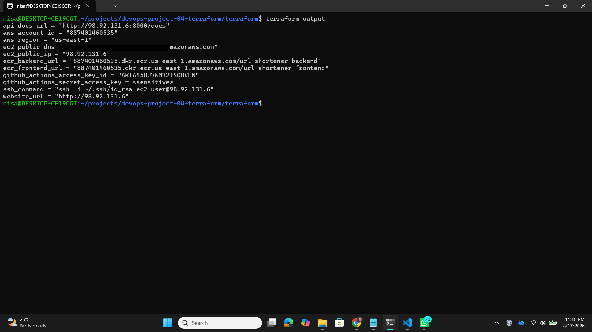

# DevOps Project 04 - URL Shortener with Terraform

A full-stack URL shortener application deployed to AWS using Terraform for Infrastructure as Code and GitHub Actions for CI/CD automation.

## Project Overview

This project demonstrates a complete DevOps workflow by deploying a Python-based URL Shortener to AWS. The entire infrastructure is provisioned using Terraform (Infrastructure as Code) and deployment is fully automated through GitHub Actions CI/CD pipeline. This is the first project where zero AWS resources were created manually—every EC2, ECR, IAM role, and Security Group was born from Terraform code.

## Tech Stack

| Layer | Technology |
|-------|------------|
| Frontend | HTML, CSS, Vanilla JavaScript |
| Web Server | Nginx (reverse proxy) |
| Backend | Python 3.12 + FastAPI |
| Database | PostgreSQL 15 |
| ORM | SQLAlchemy |
| Containerization | Docker + Docker Compose |
| Infrastructure | Terraform (HCL) |
| Cloud | AWS (EC2, ECR, IAM, VPC) |
| CI/CD | GitHub Actions |
| Version Control | Git + GitHub |

## Architecture

```
┌──────────────┐      ┌─────────────────────────────────────────┐
│ User Browser │─────▶│ AWS EC2 (t3.micro)                      │
└──────────────┘      │                                         │
                      │  ┌──────────┐  ┌──────────┐  ┌────────┐│
                      │  │ Frontend │  │ Backend  │  │Database││
                      │  │ Nginx    │▶ │ FastAPI  │▶ │Postgres││
                      │  │ :80      │  │ :8000    │  │ :5432  ││
                      │  └──────────┘  └──────────┘  └────────┘│
                      │  Docker Compose Network                 │
                      └─────────────────────────────────────────┘
                                      ▲
                                      │
                      ┌─────────────────────────────┐
                      │ GitHub Actions CI/CD        │
                      │ Build → Push → Deploy       │
                      └─────────────────────────────┘
```

## Project Structure

```
devops-project-04-terraform/
│
├── frontend/                         # Nginx + HTML/CSS/JS
│   ├── index.html
│   ├── nginx.conf
│   └── Dockerfile
│
├── backend/                          # Python FastAPI
│   ├── main.py
│   ├── database.py
│   ├── models.py
│   ├── requirements.txt
│   └── Dockerfile
│
├── terraform/                        # Infrastructure as Code
│   ├── provider.tf
│   ├── variables.tf
│   ├── terraform.tfvars             # gitignored
│   ├── ecr.tf
│   ├── security-group.tf
│   ├── iam.tf
│   ├── ec2.tf
│   └── outputs.tf
│
├── .github/workflows/
│   └── deploy.yml
│
├── docker-compose.yml
├── .gitignore
└── README.md
```

## Features

- Shorten any long URL to a 6-character code
- Redirect short URLs to original destinations
- Track click count for each URL
- View recent shortened URLs
- Real-time stats dashboard
- Persistent PostgreSQL storage
- Auto-deploys on every git push

## Run Locally

### Prerequisites
- Docker & Docker Compose
- Python 3.12+
- Git

### Quick Start

```bash
# Clone repository
git clone https://github.com/Nisansala23/devops-project-04-terraform.git
cd devops-project-04-terraform

# Build and start all containers
docker-compose up --build

# Access the app
open http://localhost
```

### Stop Services

```bash
# Stop all containers
docker compose down

# Stop and remove volumes (deletes database data)
docker compose down -v
```

## Deploy to AWS with Terraform

### Prerequisites
- AWS account with configured CLI
- Terraform installed (>= 1.0)
- SSH key pair configured

### Setup Steps

```bash
cd terraform/

# Create terraform.tfvars
cat > terraform.tfvars << EOF
aws_region        = "us-east-1"
project_name      = "url-shortener"
environment       = "production"
ec2_instance_type = "t3.micro"
my_ip             = "YOUR_IP/32"
db_name           = "urlshortener"
db_user           = "urluser"
db_password       = "YourStrongPassword"
EOF

# Initialize Terraform
terraform init

# Preview changes
terraform plan

# Create infrastructure (13 resources)
terraform apply
```

## GitHub Actions Secrets Setup

After `terraform apply`, add these secrets to your GitHub repository:

| Secret Name | Source |
|------------|--------|
| AWS_ACCESS_KEY_ID | `terraform output github_actions_access_key_id` |
| AWS_SECRET_ACCESS_KEY | `terraform output -raw github_actions_secret_access_key` |
| EC2_HOST | `terraform output ec2_public_ip` |
| EC2_SSH_KEY | Content of `~/.ssh/id_rsa` |
| ECR_FRONTEND | `terraform output ecr_frontend_url` |
| ECR_BACKEND | `terraform output ecr_backend_url` |
| DB_NAME | `urlshortener` |
| DB_USER | `urluser` |
| DB_PASSWORD | Your password from tfvars |

## CI/CD Pipeline

The GitHub Actions workflow runs 3 jobs on every push to main:

```
┌──────────────────┐    ┌──────────────────┐    ┌──────────────────┐
│  1. BUILD        │───▶│  2. DEPLOY       │───▶│  3. VERIFY       │
│                  │    │                  │    │                  │
│ • Build images   │    │ • SSH into EC2   │    │ • Health check   │
│ • Push to ECR    │    │ • Pull images    │    │ • HTTP 200 OK    │
│                  │    │ • docker-compose │    │                  │
└──────────────────┘    │   up -d          │    └──────────────────┘
                        └──────────────────┘
```

| Job | Duration |
|-----|----------|
| Build & Push to ECR | ~40s |
| Deploy to EC2 | ~25s |
| Verify Deployment | ~35s |

## AWS Resources Created (via Terraform)

| Resource Type | Count | Purpose |
|---------------|-------|---------|
| EC2 Instance | 1 | Application server |
| ECR Repository | 2 | Docker image storage |
| IAM Role | 1 | EC2 access to ECR |
| IAM User | 1 | GitHub Actions access |
| IAM Policies | 3 | Permission management |
| Security Group | 1 | Firewall rules |
| Key Pair | 1 | SSH access |
| Instance Profile | 1 | Role wrapper |
| **Total** | **13** | All in code! |

## Screenshots

### Application Running



Live application showing the URL shortener interface with stats dashboard and recent links.

### AWS Infrastructure

#### ECR Repositories


Both frontend and backend Docker images stored in AWS ECR.

#### EC2 Instance Details


EC2 instance running with all network configuration and security groups applied.

#### Terraform State


All 13 AWS resources created and tracked by Terraform state.

### Deployment

#### Containers Running on EC2


SSH session into EC2 showing all three containers (frontend, backend, database) running and healthy.

#### GitHub Actions Pipeline


Successful CI/CD pipeline execution with all 3 jobs completed in ~1m 43s.

#### Terraform Output


Infrastructure outputs including API endpoint, EC2 IP, ECR URLs, and SSH command.

## What I Learned

### Terraform Skills
- Writing HCL (HashiCorp Configuration Language)
- Resource dependencies and references
- Variables, outputs, and data sources
- State management and terraform init/plan/apply/destroy workflow
- Managing AWS resources declaratively

### AWS Skills
- EC2 instance provisioning with user data scripts
- ECR (Elastic Container Registry) for Docker images
- IAM roles vs users and permission management
- Security Groups (firewall rules)
- VPC configuration and networking
- Understanding regions and availability zones

### DevOps Skills
- Infrastructure as Code principles
- GitOps workflow and version-controlled infrastructure
- CI/CD pipeline design for multi-stage deployments
- Container orchestration with Docker Compose
- Zero-downtime deployments
- Secrets management and sensitive data handling

### General
- Importance of .gitignore for protecting secrets
- Cost awareness in cloud deployments
- Reproducible and idempotent infrastructure
- Documentation and code readability matter

## Challenges & Solutions

### Challenge 1: SSH Timeout from GitHub Actions
**Problem:** Security group only allowed home IP, GitHub Actions couldn't connect.

**Solution:** Opened SSH port to 0.0.0.0/0 but kept SSH key-based authentication for security.

### Challenge 2: ECR Repository Delete Failed
**Problem:** `terraform destroy` failed because ECR repositories contained images.

**Solution:** Added `force_delete = true` to ECR resource in Terraform.

### Challenge 3: Hardcoded Localhost in URLs
**Problem:** Backend returned hardcoded localhost URLs in short links.

**Solution:** Changed to relative URLs, letting frontend prepend current domain dynamically.

### Challenge 4: Nginx 404 for Homepage
**Problem:** Nginx location matching was ambiguous between static files and backend proxy.

**Solution:** Used `try_files` with `@backend` named location for proper fallback.

## Cleanup (Important!)

To avoid AWS charges, destroy all resources when done:

```bash
cd terraform/
terraform destroy

# Type 'yes' when prompted
# Wait ~2 minutes for complete cleanup
```

## Author

Nisansala Sandeepani
DevOps Engineer | AWS | Docker | Terraform

GitHub: [@Nisansala23](https://github.com/Nisansala23)

---

**Status:** ✅ Project completed successfully with all resources deployed and auto-deploying via CI/CD
